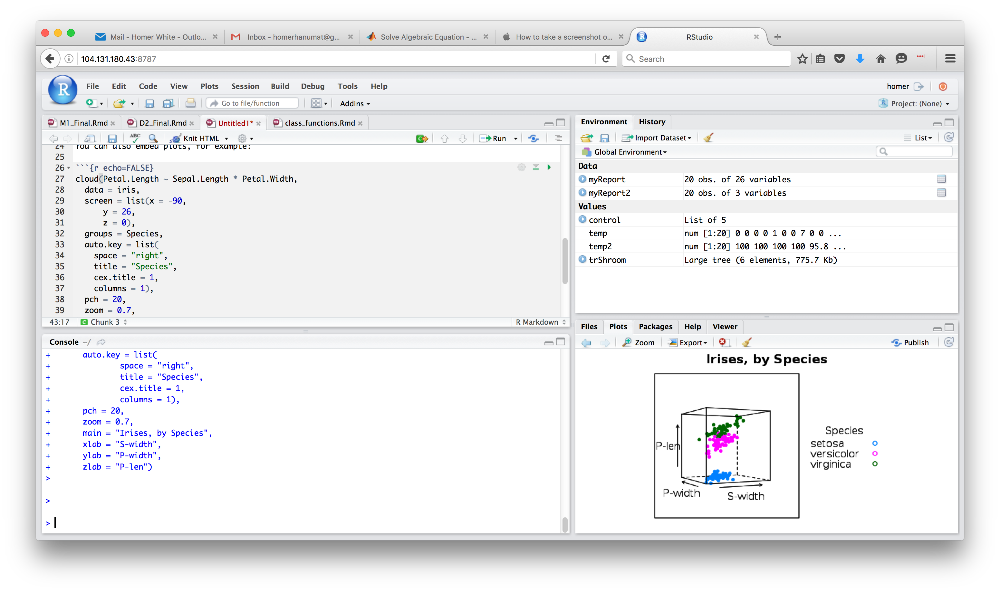
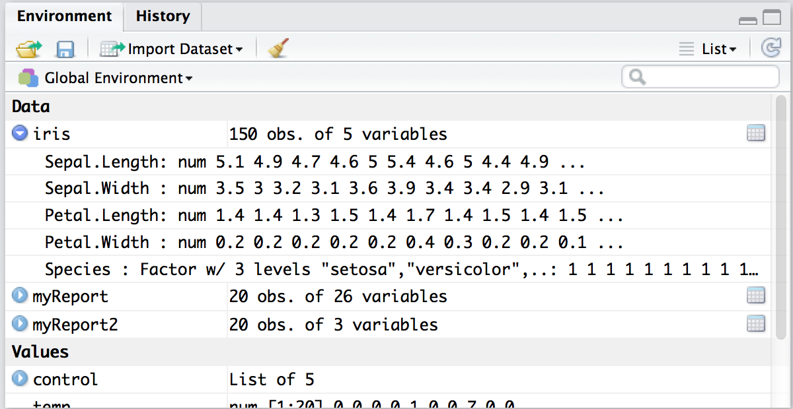
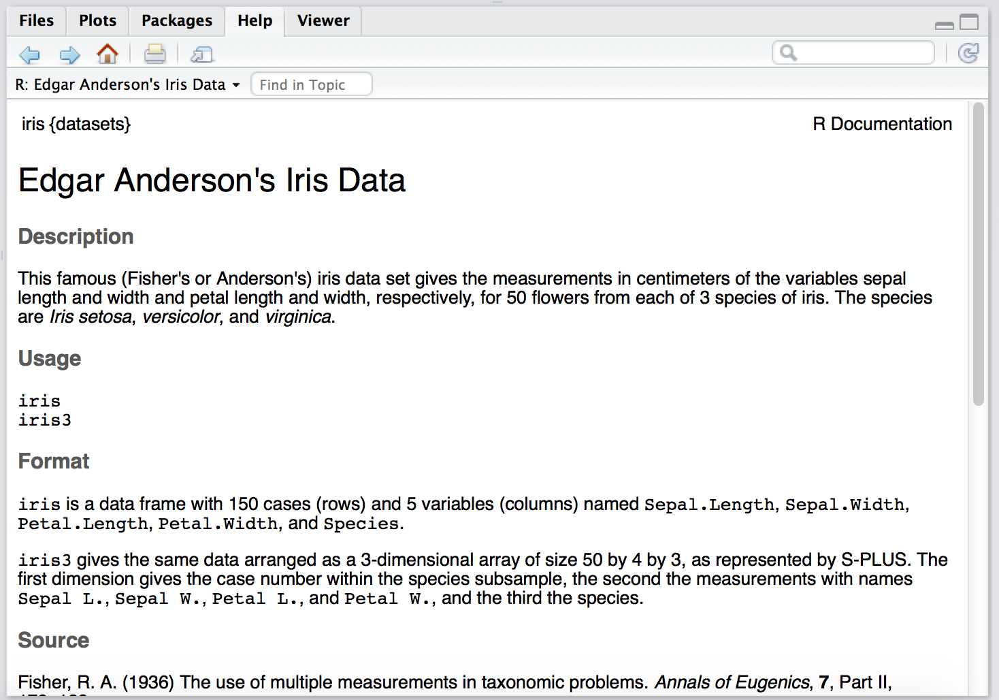

```{r setup, include=FALSE}
knitr::opts_chunk$set(echo = TRUE)
library(tigerstats)
library(knitr)
```

# Foundations at Georgetown College

## Foundations and Core

Georgetown's "new gen ed" (since 2010):

* Foundations (basic skills)
    * two-semester Foundations sequence in first year
    * basic proficiency in:
        * mathematics
        * composition
        * lifetime fitness
* Core
    * Courses selected from four *Areas of Inquiry*
    * flagged courses for continued development of basic skills in mathematics and composition
    * flagged courses for cultural awareness
    
## Foundations I (FDN 111)

* Fall semester of first year
* mostly uniform across all sections
* unifying theme:
    * "Revolution and Renaissance" (2010-2015)
    * "What is it to be Human?" (2016 - ?)
* chronological approach
* primary texts (some art/music as well)
* stress on development of basic skills within given content
    
## Basic Skills

* Primary Skills ("Read-Write-Argue" Trinity)
    * Analytical Reading
    * Argumentation
    * Composition
* Meta-Skills
    * Engagement
    * Self-Assessment
    
The three primary skills have (inter-woven) components that are explicitly addressed in most sections of the course.

## Reading

* Read for Structure
* Read to Interpret
* Read in Context
* Read in a Spirit of Critical Engagement

## Reading for Structure

The *structure* of a thing is

* the kind of thing that it is (e.g., drama, novel, short-story, poem, etc.), and
* a statement of:
    * its parts
    * how these parts are related to one another
    
Structure guides interpretation.

Outlining:  a typical exercise in reading for structure.

## Reading to Interpret

* macro level -- overall theme
* micro levels -- paragraph, sentence, phrase, words
* typical exercises:
    * sentence paraphrase
    * summarize paragraph in sentence
    * analyse similes (often involves structural analysis)
    
## Simile and Structure

[From the Iliad:]

Achilles wasted no time.  Leaving his spear
Propped against a tamarisk
And holding only his sword, he leaped from the bank
He struck over and over …

>*Fish fleeing from a dolphin’s huge maw
Hide by the hundreds in the harbor’s crannies
But the dolphin devours whatever it catches.*

Likewise the Trojans beneath the riverbanks.

## Simile as Isomorphism

Tenor (literal)  | Vehicle (symbolic)
------------- | -------------
Achilles  | Dolphin
Trojans  | Fish
Sword  |  Huge maw
Riverbank | Crannies of the harbor

<br>
The map is structure-preserving:

* dolphin **pursues** the fish; Achilles **pursues** the Trojans
* dolphin **destroys with** mouth, Achilles **destroys with** sword
* etc.

## Read in Context

Consider

* the time period, cultural setting
* situation and purposes of the author
* intended audience

## Read with Critical Engagement

* Do I really believe this claim?
* Who else makes a similar point?
* What would the author have said if ... ?
* ...

Often explicitly treated.  In class, instructor might ask:  "What's a good critical engagement question about this passage?"

## Argue

Sub-skills are:

* **Describing** arguments (identifying premises, conclusion)
    * Often combined with structural reading.
* **Evaluating** arguments
* **Constructing** one's own arguments
    * Often done in interpretation.  FDN 111 mantra:  "Back up your interpretation with specific citations from the text!"
    
## Write

* Two major (4-5 page) thesis-driven essays, prepared for by near-daily small assignments.
* Process-writing is taught:
    * free-writing
    * writing down reasons to believe/disbelieve a claim
    * outlining
    * draft and draft conference
    * peer review, etc.
    
## Foundations II (FND 112)

* Spring of the first year
* topic varies from section to section
* "modestly interdisciplinary"
* emphasis is on continued skills development in the context of the primary discipline

# FDN 112/ MAT 111:  Elementary Statistics

## FDN 112

* fulfills quantitative proficiency requirement (QPR)
* quantitative "flag" for those who have already fulfilled (QPR)
* mostly traditional content

## FDN 112

* descriptive statistics
* early into to chi-square inference (association)
* simple linear regression (almost no inference)
* confounding variables
* **Interlude**:  basic predictive statistics with trees (classification, regression)
* design of studies
* whirlwind probability (including probability in simple random sampling)
* confidence intervals for the "Basic Five"" parameters
* hypothesis tests for the same
* chi-square Goodness of Fit (as time permits)
    
## FDN 112

Non-traditional aspects:

* predictive statistics
* simulation-based inference taught as much as possible (apps employed heavily)
* but no bootstrap (yet)
* taught with R, in the R Studio IDE (server)
* integrates FDN skills approach/terminology

## The RStudio Environment



## Skills Integration

>*"Elementary statistics isn't really a course in mathematics.*

>*It's a course about judgement."*

---Daniel Kaplan, Macalester College

## Skills Integration

We read, argue and write about **data**.

(Typically in the form of an R data *data frame*!)

Understanding of data is driven by employing the **Read** skill in each of its four aspects:

* reading for structure
* reading to interpret
* reading in context
* reading to engage

"Watch your process:  be aware of when you are applying each sub-skill."

# Reading

## Reading for Structure

R reads for structure, with the `str()` function:

```{r}
str(iris)
```

## Structure of Variables:

```{r}
with(iris, str(Species))
```

## In the IDE



## Read to Interpret

Tell the story of the data as it stands?  (Numerical and graphical summaries.)

"Structure guides interpretation."  Appropriate tools chosen by mean of **variable analysis**:

* Given a Research Question, identify all variables in the data frame that pertain to it.
* Identify the type of each variable (numerical, factor).
* If appropriate, identify explanatory/response variables.

## Read in Context

```{r eval = FALSE}
help(iris)
```



## Read for Critical Engagement

* Are there any unusual observations?  What should I do about them?
* I see a pattern in the sample, but is it also present in the population, or could it just be due to chance variation in the process by which I got the data?
* Are there confounding variables?  How could I correct for them?
* Could there have been a different/better way to measure this variable?
* Data-snooping/mining?

# Argumentation

## Arguments:  Description/Evaluation

```{r echo = FALSE}
guncap <- xtabs(~owngun+cappun, data = gss02)
kable(guncap)
```

<br>

**Comment:**  "Folks who don't own a gun are more likely to oppose capital punishment than those who do own a gun, because 199 non-owners oppose capital punishment whereas only 59 gun-owners do."

## Arguments:  Construction

* Small-scale:
    * explain why a given random variable can/cannot be modeled with a binomial distribution
    * explain why a given variable is a confounding factor in an observational study
    * back up a statement of relationship with specific relevant features of a table/graph
* Larger-scale:
    * Inferential procedures
    * Building and testing predictive models
    * Reasoning about causation
    
# Writing
    
## Writing (Major)

Two Data Analysis Reports:

* (individual)  Wage-discrimination study from CPS data.  Is there good evidence for wage discrimination based on sex, or could the wage-gap be ascribed to one or more confounding factors?
* (group)  Predictive modeling project:  <a href="resources/Project_Mushrooms.pdf" target ="_blank">Mushrooms</a> or <a href="resources/Project_Diabetes.pdf" target ="_blank">Diabetes</a>.

Process:

* draft
* draft conference
* final version (w/oral presentation, for group project)

<a href="resources/DAR_Rubric_FDN112.docx" target="_blank">Rubrics-based</a> grading.

## Writing (Technique)

* Daily R Markdown documents, electronically collected
* Small-scale skills development addressed in the Dailies
* Reports are R Markdown, knit to pdf
* R graphics via custom-written GUI (R Studio Addin)
* Student-oriented R-package for predictive modeling with trees

# Final Thoughts

## Next Time Around ...

* Should have added an "informal analysis" stage to the first Data Analysis Report
* Nice to have more Addins to address:
    * construction of numerical tables
    * data-manipulation
    * selection/implementation of inferential techniques
* Maybe drop trees in favor of multiple regression (with emphasis on application to correcting for confounding factors)

## Resources

* [Foundations at Georgetown](https://vimeo.com/29679941)
* [Project MOSAIC](http://mosaic-web.org/) Teaching Statistics with R
* Some of my Github repos:
    * [tigerstats](https://github.com/homerhanumat/tigerstats)
    * [tigerData](https://github.com/homerhanumat/tigerData)
    * [tigerTree](https://github.com/homerhanumat/tigerTree)
    * [addinplots](https://github.com/homerhanumat/addinplots)
* Representative Shiny apps for the classroom:
    * [Chi-Square Goodness-of-Fit](http://homer.shinyapps.io/SlowGoodness)
    * [Confidence Intervals for a Mean](http://homer.shinyapps.io/CIMean)


